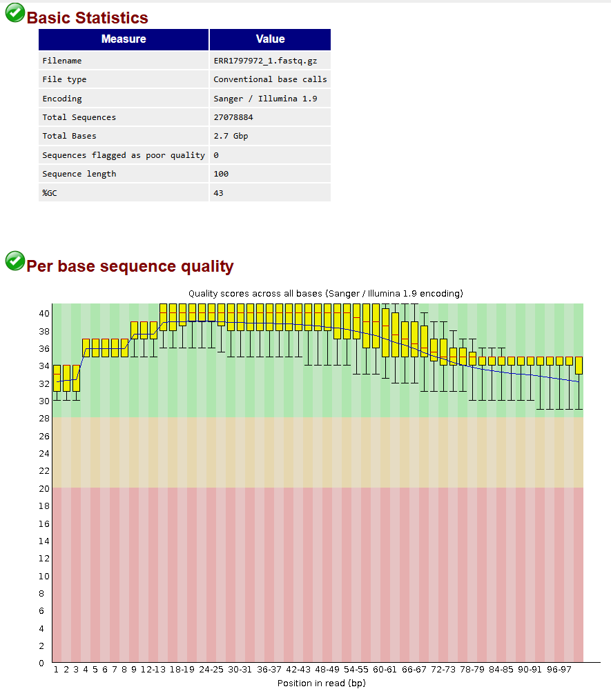
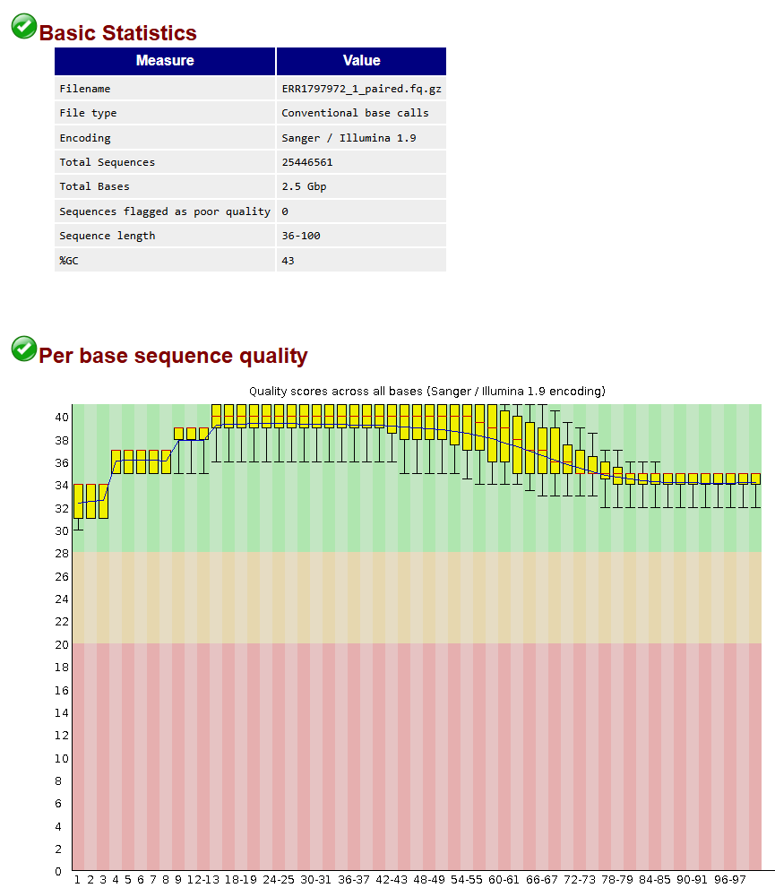

### Read Quality Control
# Data Quality
## Goal
Raw sequencing reads should always be assessed for quality before downstream analysis. If necessary, low-quality regions and adapter sequences should be trimmed or removed. A second quality control step should then be performed to confirm that all issues have been resolved before proceeding.

## Results
<table>
  <tr>
    <th>Illumina FastQC</th>
    <th>PacBio FastQC</th>
  </tr>
  <tr>
    <td></td>
    <td></td>
  </tr>
</table>

### Read Quality Control
#### 1 How is the quality of your data?
The Illumina reads are of high quality and look very suitable for downstream analysis. The FastQC report shows that all sequences are retained, the read length is consistent at 90 bp, and no reads were flagged as poor quality, which is a good sign for a cleaned short-read dataset.

The PacBio reads show the quality pattern expected for CLR data. Long-read data typically has a more variable quality profile than Illumina, and FastQC often reports several warnings or fails because it was mainly designed with short-read data in mind rather than PacBio subreads.

In other words, the Illumina data appears clean and reliable, while the PacBio data is not necessarily “bad” just because FastQC flags it. For PacBio, those warnings are often a consequence of the sequencing technology itself rather than evidence of a serious problem.

#### 2 What can generate the “fails” in FastQC that you observe in your data? Can these cause any problems during subsequent analyses?
The observed FastQC “fails” can largely be explained by the fact that FastQC is not designed for PacBio CLR data. These reads have different characteristics compared to short-read data, which leads to misleading warnings. However, these flags do not necessarily indicate issues that will negatively impact downstream analyses.

### Read Preprocessing
#### 3,5,6 Trimming? 
Trimming was not performed for the allignment data. The Illumina data was already of sufficient quality, and Trimmomatic is not suitable for PacBio data. Additionally, Canu includes its own read correction and preprocessing steps for long-read data.

#### 4 How can this affect your future analyses and results? 
Skipping trimming is unlikely to negatively affect downstream analyses, given the high quality of the Illumina reads and the internal correction performed by Canu.

### Read Preprocessing RNA-seq
To still answer questions 3 and 5, trimming on RNA-seq data was preformed. 
<table>
  <tr>
    <th>FastQC Raw</th>
    <th>FastQC Trimmed</th>
  </tr>
  <tr>
    <td></td>
    <td></td>
  </tr>
</table>

#### 3 How many reads have been discarded after trimming?
After trimming, the total number of reads decreased from 27,078,884 to 25,446,561. This means that 1,632,323 reads, approximately six percent of the dataset, were removed. This level of read loss is typical for Illumina data when low‑quality ends and adapter contamination are removed.

#### 4 How can this affect your future analyses and results?
The removal of roughly six percent of the reads is unlikely to negatively influence downstream analyses. The dataset remains large, and the reduction in coverage is minimal. In practice, trimming improves the reliability of subsequent analyses because low‑quality regions are a common source of mapping errors, false variant calls, and inflated expression estimates. By discarding problematic bases and reads, the overall accuracy of alignment, assembly, and quantification is strengthened.

#### 5 How is the quality of your data after trimming?
The post‑trimming FastQC report indicates that the data are of high quality. Median Phred scores remain above 30 across nearly all positions, and the typical decline in quality toward the end of the reads has been substantially reduced. No sequences were flagged as poor quality, and the read‑length distribution now ranges from 36 to 100 bp, reflecting the removal of low‑quality tails. Overall, the trimmed dataset is clean and well suited for downstream analysis.

#### 6 What quality threshold did you choose for the leading/trailing/slidingwindow parameters, and why?
The trimming parameters used were LEADING:3, TRAILING:3, SLIDINGWINDOW:4:20, and MINLEN:50. These thresholds are commonly applied to Illumina short‑read data because they remove only the lowest‑quality bases at the read ends while preserving as much usable sequence as possible. The sliding‑window threshold of Q20 ensures that regions with an average error rate above one percent are removed, which provides a good balance between data retention and quality. The minimum length requirement ensures that trimmed reads remain long enough to map reliably.
