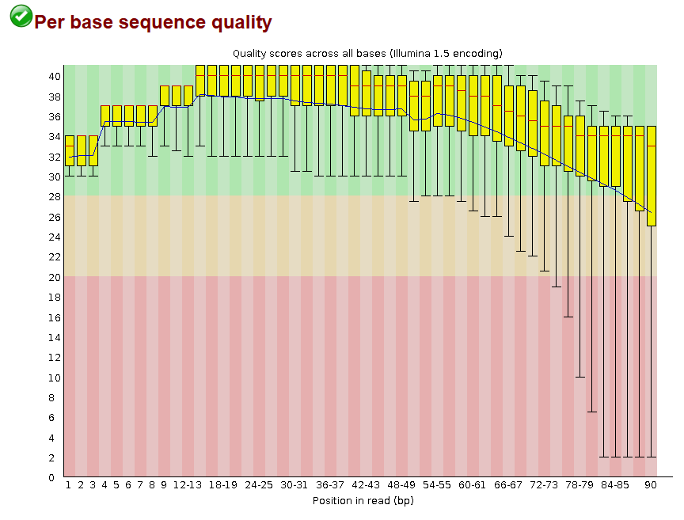
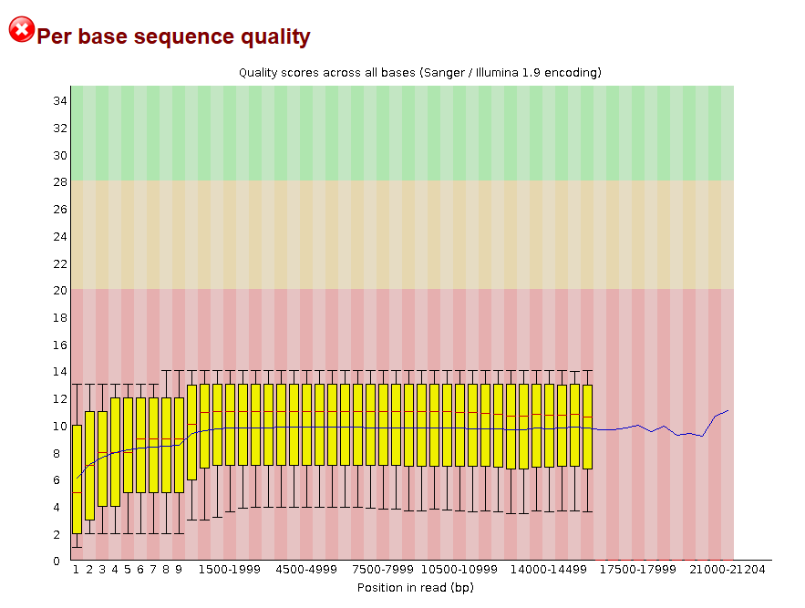

# Data Quality
## Goal
Raw sequencing reads should always be assessed for quality before downstream analysis. If necessary, low-quality regions and adapter sequences should be trimmed or removed. A second quality control step should then be performed to confirm that all issues have been resolved before proceeding.

## Results
<table>
  <tr>
    <th>Illumina FastQC</th>
    <th>PacBio FastQC</th>
  </tr>
  <tr>
    <td></td>
    <td></td>
  </tr>
</table>

### Read Quality Control
#### How is the quality of your data?
The Illumina reads are of high quality and look very suitable for downstream analysis. The FastQC report shows that all sequences are retained, the read length is consistent at 90 bp, and no reads were flagged as poor quality, which is a good sign for a cleaned short-read dataset.

The PacBio reads show the quality pattern expected for CLR data. Long-read data typically has a more variable quality profile than Illumina, and FastQC often reports several warnings or fails because it was mainly designed with short-read data in mind rather than PacBio subreads.

In other words, the Illumina data appears clean and reliable, while the PacBio data is not necessarily “bad” just because FastQC flags it. For PacBio, those warnings are often a consequence of the sequencing technology itself rather than evidence of a serious problem.

#### What can generate the “fails” in FastQC that you observe in your data? Can these cause any problems during subsequent analyses?
The observed FastQC “fails” can largely be explained by the fact that FastQC is not designed for PacBio CLR data. These reads have different characteristics compared to short-read data, which leads to misleading warnings. However, these flags do not necessarily indicate issues that will negatively impact downstream analyses.

### Read Preprocessing
#### Trimming? 
Trimming was not performed. The Illumina data was already of sufficient quality, and Trimmomatic is not suitable for PacBio data. Additionally, Canu includes its own read correction and preprocessing steps for long-read data.

#### How can this affect your future analyses and results? 
Skipping trimming is unlikely to negatively affect downstream analyses, given the high quality of the Illumina reads and the internal correction performed by Canu.
