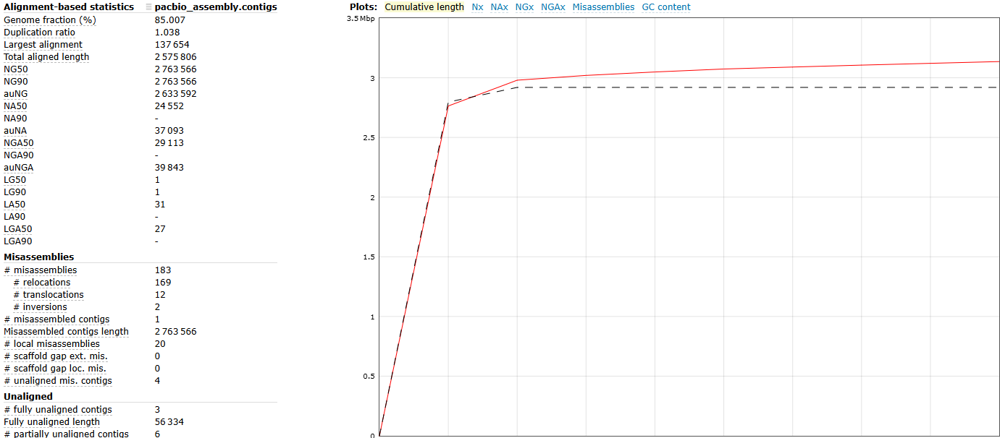
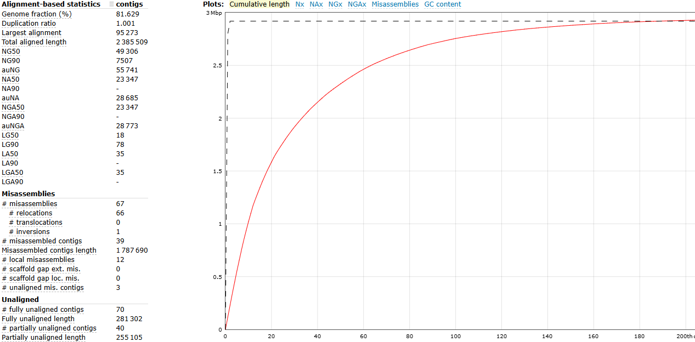
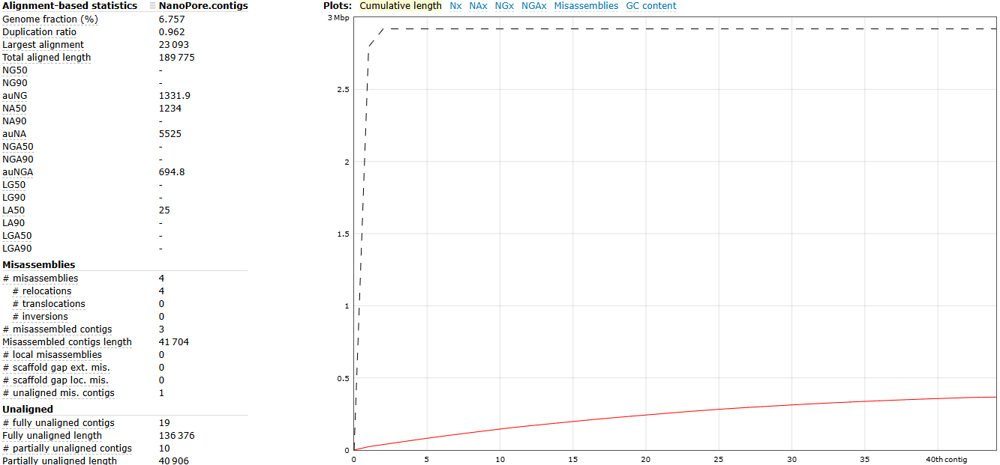
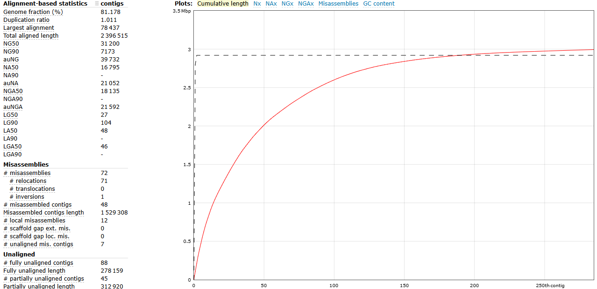

# Genome Assembly
## Goal
The aim of genome assembly is to reconstruct an accurate and contiguous representation of the genome from sequencing reads and to evaluate how well this reconstruction reflects the true sequence. In practice, this involves assessing how much of the genome is recovered, how continuous the assembly is, and whether structural or base-level errors are present. For bacterial genomes, a strong assembly should approach a full chromosome and support downstream analyses such as annotation and comparative genomics.

## Results
#### 7 What information can you get from the plots and reports given by the assembler (if you get any)? and 8 What intermediate steps generate informative output about the assembly?
Canu provides several intermediate outputs that help interpret the final assembly. The read correction step reduces sequencing errors and gives an indication of the initial data quality. Overlap detection reflects genome coverage and highlights regions of repeat complexity. Trimming and unitig construction remove low-quality sequences and simplify the assembly graph.

Together, these steps explain how the final contigs are formed and help identify whether issues such as fragmentation or misassemblies are driven by data quality, uneven coverage, or graph complexity.

#### 9 How many contigs do you expect? How many do you obtain? 
For bacterial genomes, we typically expect a single chromosome-length contig,. The PacBio assembly largely follows this expectation, as most of the genome appears to be contained within one dominant contig, with any remaining contigs likely being short. 

#### 10 Do you expect the same result between different assemblers, for the same data? If you tried different assemblers, what differences do you see in the result and why do you think that is?
Different assemblers produce different results because they rely on distinct algorithms. Canu uses an overlap–layout–consensus approach with read correction, which often produces very long contigs. Flye, on the other hand, uses a repeat-graph strategy and tends to be more conservative in ambiguous regions.

These differences affect contiguity, repeat resolution, and the number of structural inconsistencies observed in the final assembly.

#### 11 What are the k-mers? What are the problems and benefits of choosing a small or a large k-mer? 
K-mers are short sequence fragments used to construct assembly graphs, estimate coverage, and detect errors. Smaller k-mers improve connectivity but can collapse repeats, while larger k-mers increase specificity but require higher-quality data.

#### 12 Some assemblers can include a read-correction step before doing the assembly. What is this step doing? 
Read correction helps balance these trade-offs by reducing noise, improving base accuracy, and simplifying the assembly graph, which in turn improves both contiguity and reliability.

### 13 How does your assembly compare with the reference assembly? What could have caused the differences? and 14 Do you think your assembly is better/worse than the public one? 
<table>
  <tr>
    <td style="vertical-align: top;">
      <table>
        <tr>
          <th>Quast of PacBio Canu</th>
        </tr>
        <tr>
          <td></td>
        </tr>
      </table>
    </td>
    <td style="vertical-align: top; padding-left: 20px; max-width: 350px;">
      The PacBio assembly generated with Canu shows high contiguity and good overall completeness. 
      The QUAST results indicate a genome fraction of approximately 85%, meaning that most of the reference genome is recovered. 
      The assembly is dominated by a single contig of about 2.58 Mb, and the LG50 of 1 suggests that this contig represents       a near chromosome-length reconstruction.
      The duplication ratio is close to 1, indicating that repeats are not substantially overrepresented or collapsed. 
      However, 183 misassemblies are reported, reflecting structural inconsistencies relative to the reference. 
      These may arise from repeat regions, alignment artefacts, or real biological variation, 
      and they illustrate that high contiguity does not necessarily imply perfect structural accuracy.
    </td>
  </tr>
</table>

## Additional Analysis
<table>
  <tr>
    <td style="text-align: center; vertical-align: top;">
      <strong>Quast Illumina</strong> 
      
    </td>
    <td style="text-align: center; vertical-align: top;">
      <strong>Quast NanoPore</strong> 
      
    </td>
  </tr>
  <tr>
    <td style="text-align: center; vertical-align: top;">
      <strong>Quast Illumina NanoPore Hybrid</strong> 
      
    </td>
    <td style="text-align: center; vertical-align: top;">
      <strong>Quast PacBio</strong> 
      
    </td>
  </tr>
</table>
#### 1 Which assembly is more suitable for downstream analyses? Why?
Among the four assemblies, the PacBio assembly is the most suitable for downstream analyses. It provides the highest completeness, the longest contigs, and the lowest error rates, making it the most reliable reconstruction of the genome. The Hybrid (Illumina NanoPore Hybrid) assembly, although more fragmented, still recovers a large proportion of the genome with relatively few structural errors and can therefore serve as a useful secondary dataset. In contrast, the Illumina assembly is highly accurate at the base level but remains fragmented, and the NanoPore assembly is too incomplete and error‑prone to be useful for most downstream applications.

#### 2 What is the size of the largest contig of each assembly?
The PacBio assembly contains the largest contig, approximately 2.76 Mb, which is close to chromosome scale. The Hybrid assembly is much more fragmented, with its largest contig around 105 kb. The Illumina assembly produces contigs of moderate length but does not approach the continuity of PacBio. The NanoPore assembly is the most fragmented, with its longest contig only about 23 kb.

#### 3 Which assembly do you think is more accurate?
The PacBio assembly contains the largest contig, approximately 2.76 Mb, which is close to chromosome scale. The Hybrid assembly is much more fragmented, with its largest contig around 105 kb. The Illumina assembly produces contigs of moderate length but does not approach the continuity of PacBio. The NanoPore assembly is the most fragmented, with its longest contig only about 23 kb.

#### 4 Compare total assembly length to known/expected genome size. 
The expected genome size is approximately 2.92 Mb. The PacBio assembly is slightly larger than this value, which is common for long‑read assemblies due to small duplications or unresolved repeats. The Hybrid assembly is close to the expected size but fragmented. The Illumina assembly typically approximates the expected size but remains split across many contigs. The NanoPore assembly is far below the expected genome size and represents an incomplete reconstruction.

