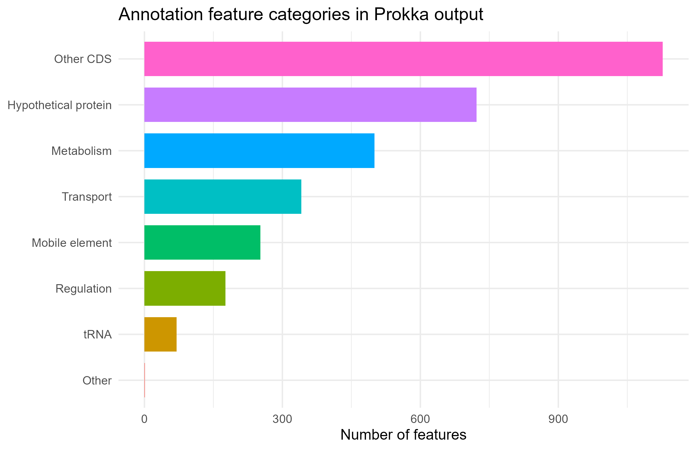
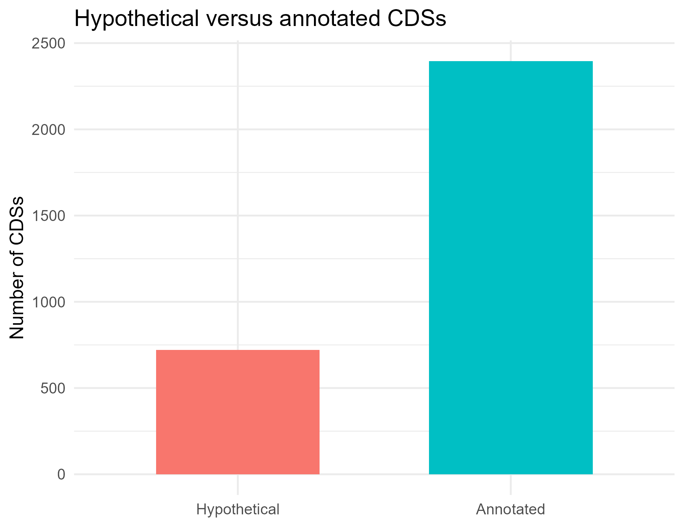

# Annotation
## Goal
The aim of the functional annotation is to assign biological meaning to the predicted genes in the assembled contigs and to assess how well the genome content is represented. In practice, this involves identifying gene types, evaluating functional assignments, and determining whether key biological features are captured.

## Results
<table>
  <tr>
    <td style="text-align: center; vertical-align: top;">
      <strong>annotated catergories</strong> 
      
    </td>
    <td style="text-align: center; vertical-align: top;">
      <strong>CDS types</strong> 
      
    </td>
  </tr>
</table>

#### 15 What types of features are detected by the software? Would you trust the prediction of some features over others and why? 
The Prokka annotation identifies a broad range of genomic features, including protein‑coding genes, tRNAs, rRNAs, metabolic enzymes, transporters, regulators, and mobile‑element–associated proteins. The feature category plot shows this diversity. Most features fall into other CDSs, followed by hypothetical proteins, metabolism‑related genes, and transporters. Smaller categories such as regulators, tRNAs, and mobile elements are also present.

#### 16 How can you evaluate the quality of the obtained functional annotation? 
The quality of the annotation can be evaluated by examining homology support, the presence of conserved housekeeping genes, and the overall distribution of functional categories. The second plot, comparing hypothetical versus annotated CDSs, shows that while most CDSs receive functional annotations, a substantial number remain hypothetical. This balance is typical for bacterial genomes and reflects both biological variability and database limitations.

#### 17 How many features of each kind are detected in your contigs? Do you detect the same number of features as the authors? How do they differ?
Looking at the annotated catergories plot on the plots, the dataset contains roughly 950 other CDSs, ~750 hypothetical proteins, and moderate numbers of metabolic, transport, regulatory, and mobile‑element genes. These counts may differ from those reported by the authors due to differences in assembly fragmentation, database versions, or annotation parameters. 

#### 18 How many genes are annotated as ‘hypothetical protein’? Why is that so? How would you tackle that problem? 
The ~750 genes annotated as “hypothetical protein” arise because many bacterial genes lack characterized homologs, evolve rapidly, or appear as partial ORFs at contig edges. This can be addressed by applying domain prediction, structural modeling, comparative genomics to identify synteny patterns, or integrating RNA‑seq evidence to refine functional assignments.

### Additional Analysis
#### 6 EggNOG protein
The EggNOG annotation provides functional predictions for a wide range of proteins, including enzymes, transporters, regulatory proteins, and components of central metabolic pathways. One example is the protein ltaS, which is assigned to the orthologous group COG1368 and linked to KEGG ortholog K19005. These identifiers place the protein in the lipoteichoic acid biosynthesis pathway and are supported by its EC number and associated KEGG reactions. Together, these annotations indicate that ltaS functions as a lipoteichoic acid synthase, an enzyme involved in building the Gram‑positive cell wall. This combination of OG assignment, pathway mapping, and reaction information strengthens confidence in the predicted function and illustrates how EggNOG integrates multiple evidence sources.

#### 7 vancomycin resistance
When focusing on antibiotic resistance, the strain is expected to be vancomycin‑resistant, but the EggNOG annotation does not recover the full set of genes typically associated with the vanA or vanB operons. None of the core resistance genes—such as vanR, vanS, vanH, vanA, or vanX—appear in the annotation. This is not unusual, as vancomycin‑resistance genes are often plasmid‑encoded, highly variable, and sometimes poorly represented in orthology‑based databases. To confirm their presence, more specialized tools such as CARD, ResFinder, or targeted BLAST searches against known van operons would be more sensitive than EggNOG alone.

#### 8 KEGG Mapper
Using KEGG Mapper to assess pathway completeness shows that most metabolic pathways are well represented, but some appear partially incomplete. For example, the shikimate pathway, which produces aromatic amino acids, lacks a clear annotation for aroE, the shikimate dehydrogenase. However, several oxidoreductases in the genome could potentially perform the same function, and similar patterns have been reported in other Enterococcus faecium strains. In these cases, paralogous enzymes or alternative dehydrogenases compensate for the missing canonical gene. This suggests that the pathway may still be functional despite the apparent gap in the annotation. Additional BLAST searches or domain‑based analyses would help identify candidate genes that EggNOG did not classify explicitly.
