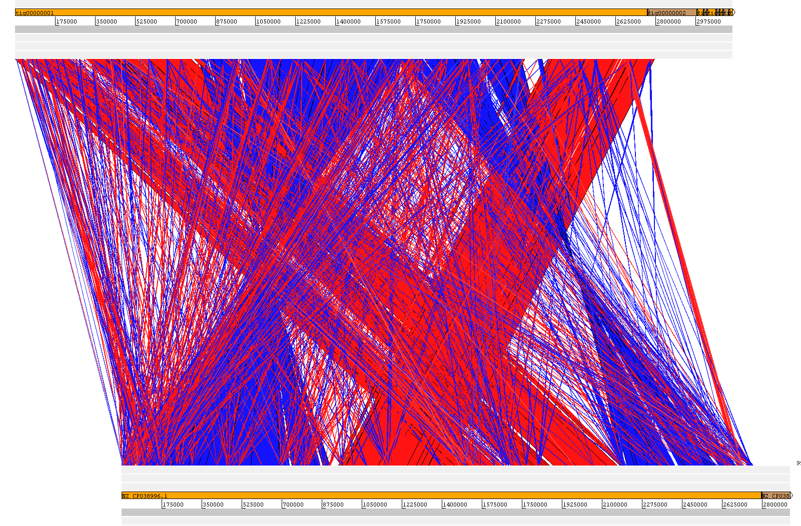

# Homology and Mapping
## Goal
The goal of this analysis is to evaluate the mapping efficiency and distribution of sequencing reads against the assembled contigs. By calculating the percentage of mapped reads and analyzing coverage across the genome, we can assess the completeness of the assembly, identify potential contamination or biological differences, and ensure that the assembly is a reliable foundation for downstream analyses.

## Results
### Homology

<table>
  <tr>
    <td style="vertical-align: top;">
      <table>
        <tr>
          <th>ACT PacBio Alignment vs NCBI</th>
        </tr>
        <tr>
          <td></td>
        </tr>
      </table>
    </td>
    <td style="vertical-align: top; padding-left: 20px; max-width: 350px;">
      Here displayed is a Blast of the PacBio Canu assembly constructed during this 
      assignment to the reference genome found on NCBI.
      The PacBio CANU assembly and the reference genome are highly similar overall, 
      but they contain multiple structural rearrangements, consisting of inversions, 
      translocations, and possibly relocations. These rearrangements should not 
      affect RNA‑seq or Tn‑seq downstream analysis, as both analyses rely on local 
      read mapping rather than global genome structure.
    </td>
  </tr>
</table>

### Mapping
#### 19 What percentage of your reads map back to your contigs? Why do you think that is? 
The mapping rate is fairly high for the BH samples, with approximately 81–84% of reads mapping back to the contigs. In contrast, the Serum samples show significantly lower mapping rates, ranging from 48–62%. This suggests that the BH dataset aligns much more effectively with the assembly than the Serum dataset. The lower mapping efficiency in the Serum samples may be due to higher biological diversity, the presence of non-target DNA, or greater structural divergence between those reads and the reference contigs.

#### 20 What do you interpret from your read coverage differences across the genome? 
Variations in read coverage often highlight regions that are more or less conserved, as well as repetitive areas that are difficult to map uniquely. High coverage areas typically represent well-assembled regions, whereas lower coverage may indicate sequencing bias, structural variations, or highly complex genomic regions. In bacterial genomes, these differences can also point to differential gene expression or variations in gene copy numbers between samples.

#### 21 Do you see big differences between replicates?
The replicates remain consistent within their respective experimental groups. The BH samples show tight clustering in their mapping percentages, and while the Serum samples show slightly more variability, they remain comparable to one another. The fact that the differences are more pronounced between the BH and Serum groups than between individual replicates suggests that the patterns are driven by distinct biological responses rather than technical inconsistencies.
