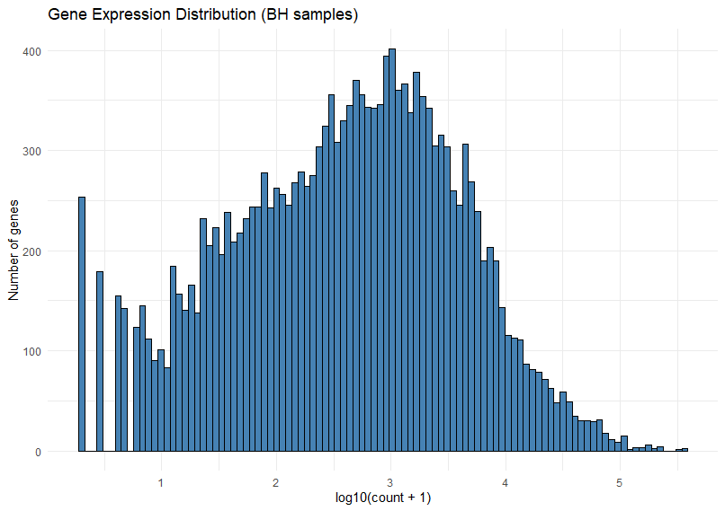
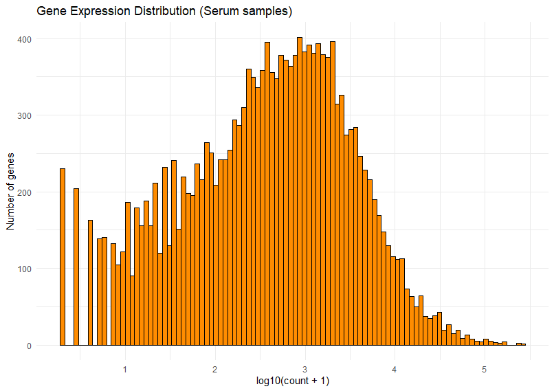

## Goal
The goal of this analysis is to examine the distribution of read counts per gene and determine how many genes are expressed in the BH (control) and Serum samples. This helps identify whether most genes receive enough reads to be considered expressed and gives a sense of the overall expression profile in each condition.

## Results
<table>
  <tr>
    <td></td>
    <td></td>
  </tr>
</table>

The count distributions for both BH and Serum are strongly right-skewed, with many genes having low counts and a smaller set of genes showing much higher expression . In both samples, the majority of genes appear to have non-zero counts, so most genes are expressed to some extent, although many are only weakly expressed .

A practical threshold for considering a gene expressed is usually at least a small number of mapped reads, often around 10 counts or more, depending on the downstream analysis. In these histograms, genes below that level make up the low-expression tail, while genes above it are more likely to represent robust expression .

The BH sample shows a slightly broader and more strongly populated high-count region, suggesting that more genes are expressed at moderate to high levels compared with the Serum sample . The Serum distribution is similar overall, but it appears somewhat more shifted toward lower counts and has a longer low-expression tail .

### Trimming
The counting and expression analyses were done with pre trimmed data. But as trimming some data is mandatory this was also performed. 

The untrimmed and trimmed reads both show strong overall quality, but the trimmed set has a cleaner profile at the 3′ end. The trimming step removes low‑quality tail bases and any remaining adapter sequence, which helps avoid small errors in mapping or assembly. The untrimmed reads were already good, but the trimmed dataset is more consistent across positions, with the weakest bases removed. This indicates that trimming was useful here—not to fix bad data, but to refine it and reduce potential downstream noise.

<table>
  <tr>
    <th>FastQC Raw</th>
    <th>FastQC Trimmed</th>
  </tr>
  <tr>
    <td></td>
    <td></td>
  </tr>
</table>
