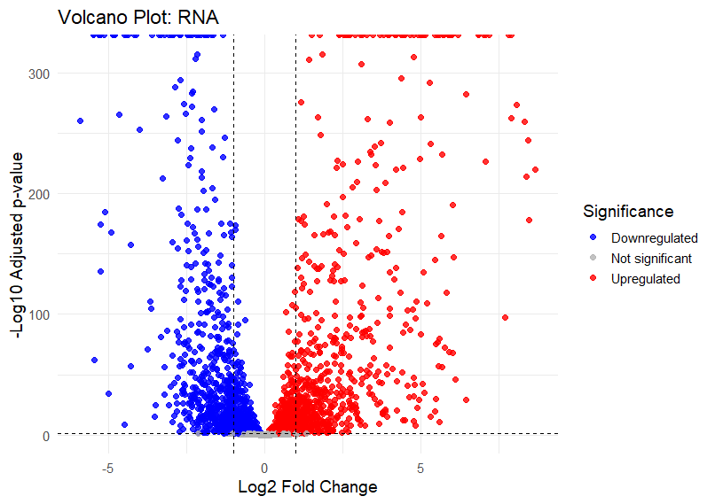
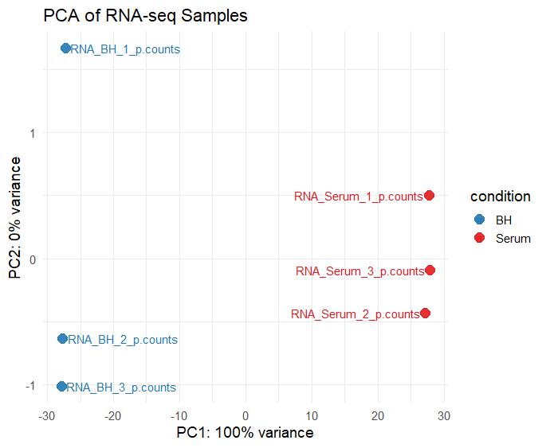
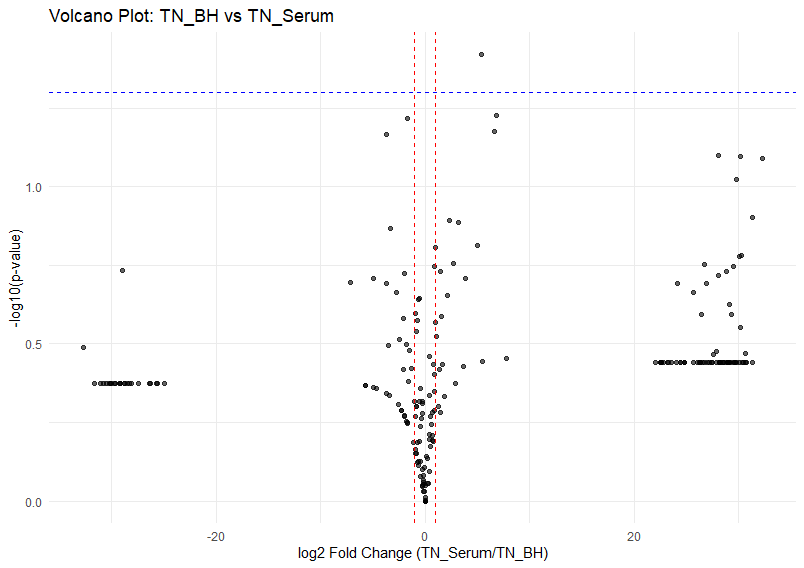
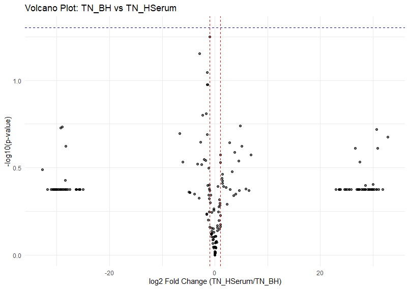

# Expression Analyses
## Goal  
The aim of the expression analysis is to identify genes that are differentially expressed between conditions, evaluate how samples cluster, and compare the resulting transcriptional patterns with those reported in Zhang et al., 2017. A secondary goal is to understand how RNA‑seq expression changes relate to Tn‑seq fitness determinants, with the broader objective of identifying genes that contribute to *E. faecium* growth in human serum.

## Results
The RNA‑seq dataset shows **modest transcriptional changes** between conditions. Compared with the published study, several technical and biological factors reduce sensitivity: many genes have very low or zero counts in the DESeq2 tables, which prevents stable dispersion and fold‑change estimation; sequencing depth and replicate numbers are lower than in the original work; and preprocessing choices (trimming, mapping, counting, filtering) differ. Together, these factors explain why relatively few genes survive multiple‑testing correction and why the overall transcriptional response appears weaker than the ~28% differential expression reported by Zhang et al.

Replicates cluster primarily by condition, indicating a real biological signal, but the separation is not strong. Log2 fold‑changes are generally small and most genes lie near zero, so although replicates are internally consistent, low counts and limited dynamic range restrict the ability to call robust DE genes. A PCA would likely show a modest separation between BH and serum, with serum and heat‑inactivated serum clustering more closely together.

<table>
  <tr>
    <td style="text-align: center; vertical-align: top;">
      
    </td>
    <td style="text-align: center; vertical-align: top;">
      
    </td>
  </tr>
</table>

Differential expression results were ranked by adjusted p‑value first and then by absolute log2 fold change. Prioritizing adjusted p‑value controls the false discovery rate, while ranking by log2Fold highlights genes with larger, biologically meaningful changes. For the sparse Tn‑seq dataset, many padj values are NA, so ranking relied on p‑value and negative log2 fold change (depletion in serum) to identify candidate essential genes. Normalization is required for RNA‑seq. DESeq2’s median‑of‑ratios size‑factor method was used and seemed to be appropriate. 

To improve statistical power, one would increase biological replication and sequencing depth, remove very low‑count genes before testing, improve RNA quality to reduce technical noise. 

## Additional Analyses
The Tn‑seq dataset provides a fitness‑based view of gene function during growth in human serum. In contrast to RNA‑seq, which measures transcriptional output, Tn‑seq quantifies how well transposon mutants survive under different conditions. The authors generated these data by sequencing the junctions between the mariner transposon and the E. faecium E745 genome. Raw Illumina reads were demultiplexed, the 16‑nt genomic fragments adjacent to the transposon were mapped to the E745 genome using Bowtie2, and mapped reads were summarized in 25‑nt genomic windows. Windows overlapping each gene were aggregated, insertions in the final 10% of each gene were excluded, and counts were normalized to RPKM, producing a quantitative measure of insertion density. This means the Tn‑seq dataset represents fitness data, not expression levels.

The goal of the Tn‑seq analysis is to identify genes whose disruption reduces survival in human serum. Genes that show depletion of insertions in serum relative to BH medium—reflected as lower RPKM values and negative log2 fold changes—are considered conditionally essential. These genes likely encode functions required to withstand nutrient limitation and stress in the bloodstream environment.

<table>
  <tr>
    <td style="text-align: center; vertical-align: top;">
      
    </td>
    <td style="text-align: center; vertical-align: top;">
      
    </td>
  </tr>
</table>

Based on the RPKM‑derived volcano plots, several genes show strong depletion in serum and therefore stand out as serum‑fitness determinants. The clearest candidates include AENJPLPP_00059, ftsW, mutS, radA, and ahpC, all of which display negative log2 fold changes and low p‑values. These genes are involved in cell division, DNA repair, and oxidative stress response pathways commonly required for survival in hostile environments such as human serum.

The volcano plots shown were created by calculating mean RPKM values for each condition, computing log2 fold changes, and applying a t‑test to compare RPKM distributions. Genes appearing on the left side of the plot with high –log10(p‑values) represent mutants that are depleted in serum, indicating reduced fitness when disrupted. This workflow provides a straightforward and interpretable method for identifying conditionally essential genes from insertion-based fitness data.
